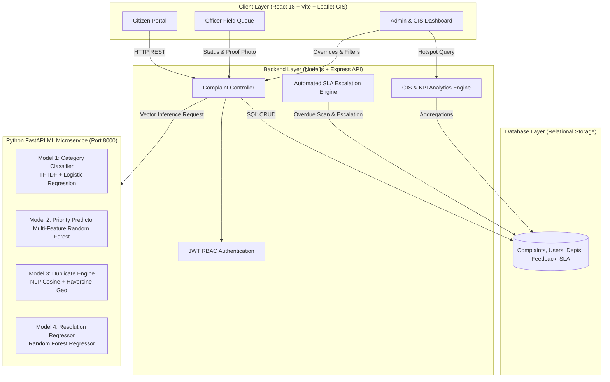
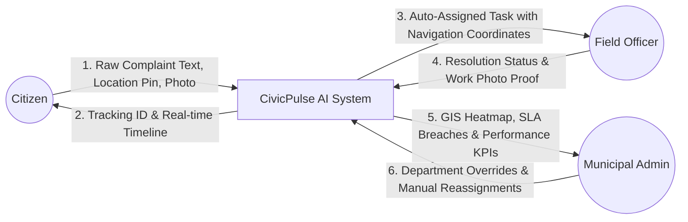
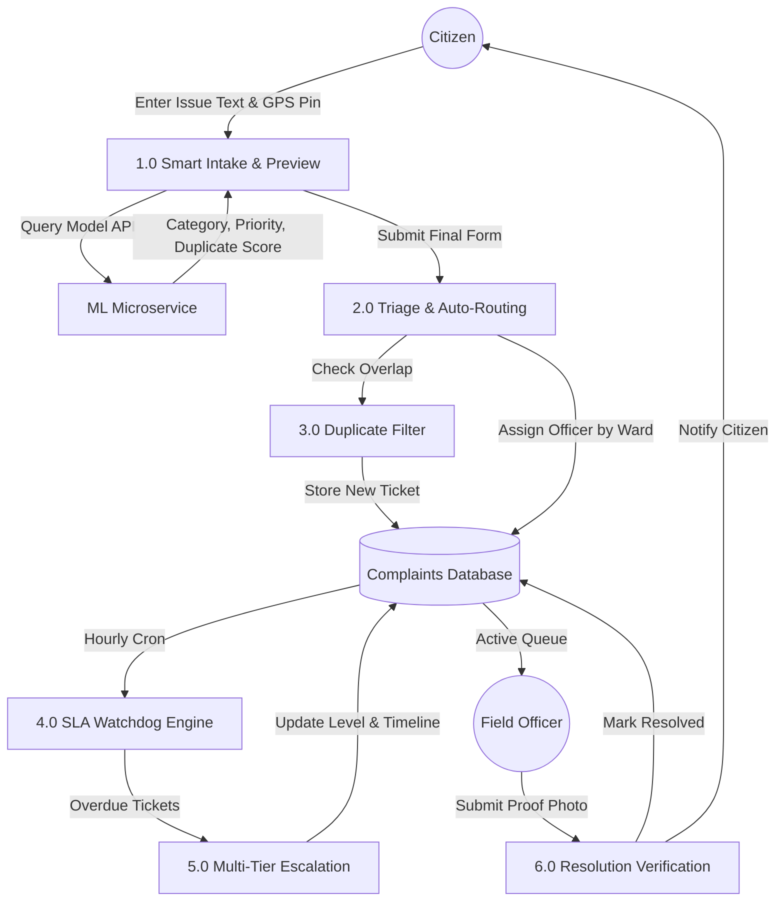
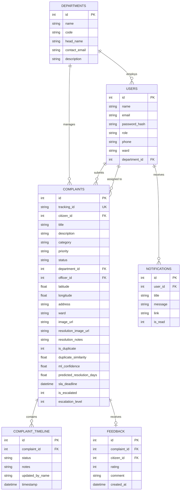

# SYSTEM ARCHITECTURE & DESIGN DIAGRAMS
## Smart Citizen Complaint and Issue Management System Using Machine Learning and Geospatial Analytics

---

### 1. System Architecture Diagram

---

### 2. Data Flow Diagram (DFD Level 0 - Context Diagram)

---

### 3. Data Flow Diagram (DFD Level 1 - Detailed Complaint Processing)

---

### 4. Entity Relationship (ER) Diagram

